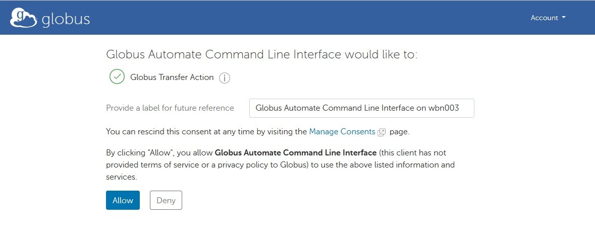

# Globus automate test

This repository provides instructions to run [Globus Automate Client](https://globus-automate-client.readthedocs.io) to transfer data from NeSI to another Globus endpoint.


## Installation

Install the client in a virtual environment:

```
module purge && module load Python/3.10.5-gimkl-2022a
python3 -m venv venv
venv/bin/python3 -m pip install globus-automate-client
```

Then activate the environment:

```
. venv/bin/activate
```

and check the client is there:

```
globus-automate --help
```

## Transferring data

To transfer data between 2 endpoints, we will use the [Transfer Data](https://globus-automate-client.readthedocs.io/en/latest/globus_action_providers.html#globus-transfer-transfer-data) action.

Make sure to activate your virtual environment before using the Globus Automate Client:

```
module purge && module load Python/3.10.5-gimkl-2022a
. venv/bin/activate
```

Then, create a file `transfer_input.json` indicating the parameters of the transfer:

```
{
    "source_endpoint_id": "ENDPOINT1",
    "destination_endpoint_id": "ENDPOINT2",
    "transfer_items": [
        {
            "source_path": "SOURCE_FOLDER",
            "destination_path": "DESTINATION_FOLDER",
            "recursive": true
        }
    ],
    "notify_on_succeeded": true,
    "notify_on_failed": true,
    "notify_on_inactive": true,
    "verify_checksum": true
}
```

where

- `ENDPOINT1` is the source endpoint UUID,
- `ENDPOINT2` is the destination UUID, e.g. your personal endpoint UUID,
- `SOURCE_FOLDER` is the path of the source folder in the source endpoint,
- `DESTINATION_FOLDER` is the path of the destination folder in the destination endpoint.

*Note: You should probably use a guest collection as source endpoint UUID instead of the NeSI Wellington DTN UUID.
The advantage is that you won't have to enter your login for the DTN in the Globus website before transfers.*

Next, start the transfer using

```
globus-automate action run --action-url https://actions.globus.org/transfer/transfer \
    --body transfer_input.json
```

The first time your use the transfer action, you will be asked an authorisation code.
Follow the indicated url to allow the transfer action.



*Note: Authentication token are cached in the file `~/.globus_automate_tokens.json`.*

The `globus-automate action run` will return a json fragment.
The first line contains the ACTION_ID which will be usefule to interact with the transfer.

For example, to query the status of the transfer, use:

```
globus-automate action status --action-url https://actions.globus.org/transfer/transfer ACTION_ID
```

You can also see and interact with the transfer actions from the Globus website at https://app.globus.org/activity.
